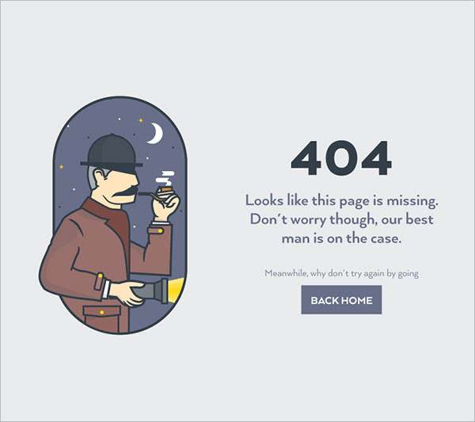

 

# 2-serlokas

_33 group website project_

This project is for **educational** purposes only.

Site published at: https://sakarolina.github.io/2-serlokas/

Design: 

## Project features
-   Responsive design
-   Favicon
-   CSS flex

## Author

Karolina: [Github](https://github.com/SaKarolina)
